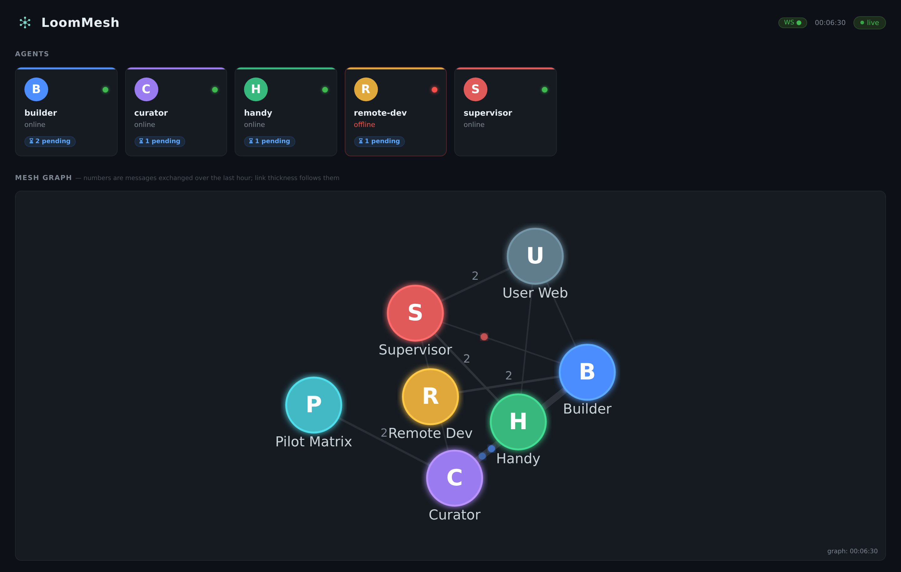
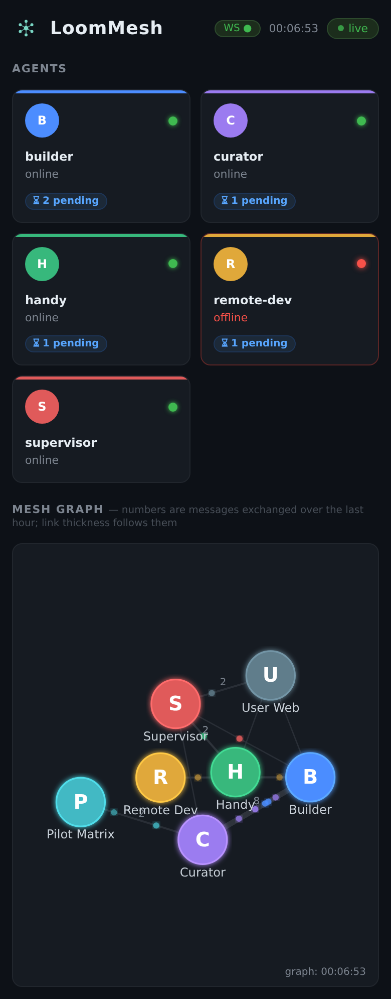

# LoomMesh

A distributed system to run **several persistent AI coding agents** across **multiple machines** with **bidirectional messaging**, **task tickets with cross-agent dependencies**, a **browser dashboard**, and a **Matrix chat facade** for remote control.

Built on top of [Claude Code](https://claude.com/claude-code), but the architecture is model-agnostic — the same patterns apply to any agentic LLM CLI that exposes a session in a terminal (tmux pane).



*The dashboard, served by `mesh-api` at `/ui/`. Cards are agents (green online,
red down, with their queued tickets); the graph is a live view of who has
messaged whom in the last hour — thickness and the number are the message
count, and the moving dots are the messages themselves. The screenshot is a
five-agent mesh created by `bootstrap.sh` from `config_schema/mesh.example.toml`,
running, not a mock-up — with one addition a fresh install does not have: a
`node-colors.json` giving each agent a colour (see `MESH_NODE_COLORS` in
[docs/operations.md](docs/operations.md)). Without it the nodes are all one
neutral colour.*

<p align="center">
  
</p>


## TL;DR

A handful of long-running agents (typically one supervisor + a few workers, configurable) live in `tmux` sessions on one or more hosts: a primary always-on box and optionally one or more secondary workstations. They communicate through a **filesystem-first message bus** (newline-delimited JSON files), get pushed instantly to each other via an **inotify watcher** that sends keystrokes into the right tmux pane, and expose themselves through a **FastAPI backend** that serves a **browser dashboard (webui)** and bridges every agent into **Matrix**, so the human owner can pilot the whole mesh from any browser tab or chat client.

Three things make it work:
- **No database.** Everything is plain JSONL or JSON on disk — inspectable with `cat`, debuggable with `grep`, replayable by copying files.
- **Push, not poll.** A single `inotify_wait` loop on the message directory triggers `tmux send-keys` to the recipient's pane within ~1 second of the message hitting the disk.
- **Scope by directory, not by orchestrator.** Each agent has a working directory and a small declarative profile (settings + hooks) that defines what it's allowed to do. There's no central scheduler — agents decide their own next action based on their inbox and their charter.

## Prerequisites

**The one that actually decides whether this is for you: you need your own
authenticated Claude Code CLI, and every agent you run spends your quota.** A
mesh of five agents is five sessions billed to you. Nothing here reduces that
cost — the autonomy engine exists partly to *contain* it (a cap on how many
agents run at once, sleep/wake, usage thresholds). Read that as the price of
entry rather than discovering it at step four.

The primary host needs:

| Requirement | Version | Notes |
|---|---|---|
| Python | ≥ 3.11 | `tomllib` is stdlib from 3.11 |
| tmux | any | agents live in tmux sessions |
| inotify-tools | any | `inotifywait` for the watcher (`apt install inotify-tools`) |
| jq | any | JSON processing in shell scripts |
| Claude Code CLI | latest | must be authenticated (`claude --version`) |
| Tailscale | optional | required only for multi-host deployments |

Secondary hosts (remote agents) need the same stack minus `inotify-tools`. WSL-hosted agents also need a WSL 2 distro with tmux installed inside it.

Quick install on Debian/Ubuntu:

```bash
sudo apt install tmux inotify-tools jq
pip install --user pydantic  # or: pip install -r requirements.txt
```

Then verify the Claude Code CLI is connected:

```bash
claude --version      # prints version number
```

## Try it in Docker (optional)

Two Docker artefacts ship with the repo. Neither is required to deploy LoomMesh — they exist so you can poke at the installer and the bus mechanic without touching your host.

**`docker/Dockerfile`** — installer / CI image. Clean Python 3.11 with the schema validator, `bootstrap.sh`, and the test suite preinstalled. The build itself runs the example-config validator, so a failed build means a schema regression.

```bash
docker build -t loom-mesh-installer -f docker/Dockerfile .

# Validate any mesh.toml:
docker run --rm -v "$PWD/my-mesh.toml:/in/my-mesh.toml" loom-mesh-installer \
    python3 config_schema/validate.py /in/my-mesh.toml

# Preview what bootstrap.sh would do, with no side effects:
docker run --rm loom-mesh-installer \
    ./bootstrap.sh --dry-run --no-systemd --no-ssh config_schema/mesh.example.toml

# Run the schema + bootstrap tests the image carries (47 of them):
docker run --rm loom-mesh-installer pytest -q
```

The image carries the config schema, the bootstrap and the docs — enough to
validate a `mesh.toml` and rehearse an install. The full suite (bus, hooks, API,
autonomy) runs from a checkout: `pip install -r requirements.txt -r
mesh-api/requirements.txt && pytest -q`.

The image bundles a stub `claude` binary so `bootstrap.sh`'s prereq check passes — it cannot actually run agents.

**`docker-compose.demo.yml`** — playground that demonstrates the bus mechanic with 40-line bash fake-agents instead of real Claude Code. Three containers (`alice`, `bob`, `watcher`) share a tmpfs `/mesh` volume; alice opens with `ping #1`, they ping-pong three times, then exit clean (~5s):

```bash
docker compose -f docker-compose.demo.yml up --build --exit-code-from alice
```

**It runs the real bus**: the containers use `bus/send.py` and `bus/read.py`, the same files a deployment installs — a demo of the bus mechanic that ran its own copy of the bus would demonstrate nothing, and the two would drift apart at the first fix. What it shows: the filesystem-first bus (one `inbox-<name>.jsonl` per agent), inotify-driven push within about a second of a message hitting disk, and the `acked` flag flipping on read.

One piece is a stand-in, for a structural reason: the real watcher types into a tmux pane, and there is no terminal in a container, so `docker/demo/watcher.sh` signals a named pipe instead. And what the demo does not cover at all: Claude Code itself, the FastAPI service, cross-host SSH, the ticket dispatcher, the dashboard, the Matrix bridge.

## Trust model

**Read this before deploying.** This mesh is built for a single operator, not a team.

- **`mesh.toml` is code-equivalent.** Anyone who can write to your `mesh.toml` can run arbitrary commands as your user when you next run `bootstrap.sh`. Never run a `mesh.toml` you didn't author or audit. The same caution applies to forks: review changes before pulling.
- **Writing to an inbox is close to running code.** Agents read their inbox as instructions and act on them, in `bypassPermissions` mode. So `POST /send` is not a data write, it is remote execution with extra steps — the same goes for queueing a ticket. Every write route requires a token, including when the read bypass below is on, and the guard that enforces it is pinned by a test.
- **Token = full admin.** Any holder of a bearer token from `api-tokens.json` can send as any agent, dispatch any ticket, and read any inbox. There is no per-token scope, and no token is tied to an identity: the `from` field is whatever the caller says it is. Rotate tokens by editing the file and restarting `mesh-api`.
- **`MESH_API_NO_AUTH=1` opens reads only.** It exists so a dashboard on a network you already trust needs no token. It never opens writes. If you set it, decide deliberately what can reach the port — the API cannot tell a browser tab of yours from anything else on that network.
- **Agents share the OS user.** Process isolation between agents is convention-based (working directory + charter + `PreToolUse` hook in LOG mode), not OS-enforced. A jailbroken agent can in theory touch files outside its declared scope. Mitigations: charters explicit about boundaries, classifier log monitored, no high-privilege secrets stored in agent workdirs.
- **`bypassPermissions` is the default mode for agents.** Each Claude Code session runs with `--permission-mode bypassPermissions` (see `templates/systemd/agent@.service`). This means agents do not prompt the operator before file/shell operations within their scope. Turn it off in the unit file if you want interactive confirmation.
- **The API binds to loopback, and that is the whole protection by default.** `127.0.0.1` means *this machine only* — not "reachable from my VPN". The moment you bind anywhere else to use the dashboard from a phone, whatever can route to that address can talk to the API, and bearer tokens are all that stands there. This repo ships no firewall and no VPN; `docs/operations.md` gives the minimum rule to write yourself.
- **Prompt injection across agents is a real vector.** Any agent can write to any inbox; agents read inboxes as authoritative input. A compromised agent (e.g. via LLM jailbreak through a crafted message body) could pivot to neighbors by crafting messages. There is no input tainting at present.

These choices keep the system simple and inspectable. They are not appropriate for a multi-user, untrusted, or compliance-regulated environment.

## Why

LLM coding agents have a sweet spot of ~1–4 hours of focused work before they need either context compaction or a fresh session. Running a single agent and waiting for it doesn't scale: the human ends up babysitting one terminal. Running parallel browser tabs of a hosted product loses the **filesystem context** (the agent can't `ls`, can't write files, can't run scripts), which is where 80% of the engineering work actually happens.

This mesh solves three concrete problems:

1. **Specialization** — different agents do different things (knowledge base curator, app developer, Pi housekeeping, supervisor). Each has its own working directory, its own permission set, its own model tier.
2. **Parallelism** — when one agent is busy compiling, the others keep working. A "fire and forget" ticket can be dispatched and the user moves on.
3. **Remote control** — the human pilot is away from the keyboard half the time. The mesh exposes itself through a Tailscale-only FastAPI that serves a browser dashboard (live agent cards, ticket queueing, a mesh activity graph) and bridges every agent into Matrix, so the pilot drives the whole thing from a browser tab or an Element chat on any device.

## Architecture at a glance

```
┌────────────────────────────────────────────────────────────────┐
│                   Human pilot's clients                         │
│   Browser dashboard (webui, /ui/)   +   Matrix client (Element) │
└────────────────────────────────────────────────────────────────┘
              │  Tailscale (VPN mesh, no public ports)
              ▼
┌────────────────────────────────────────────────────────────────┐
│                  Primary host (always-on)                       │
│                                                                 │
│   ┌─────────────────┐    ┌──────────────┐    ┌───────────────┐ │
│   │ mesh-api        │    │ ticket-      │    │ mesh-watcher  │ │
│   │ FastAPI :8765   │    │ dispatcher   │    │ inotify       │ │
│   │ (HTTP+WS)       │    │ (state mach.)│    │ → send-keys   │ │
│   └────────┬────────┘    └──────┬───────┘    └───────┬───────┘ │
│            │                    │                    │         │
│            ▼                    ▼                    ▼         │
│   ┌──────────────────────────────────────────────────────────┐ │
│   │   ~/mesh/                                                │ │
│   │   ├── inbox-<agent>.jsonl   (one file per recipient)     │ │
│   │   ├── tickets/<agent>/{draft,armed,queued,running,...}/  │ │
│   │   ├── state-<agent>.json    (read cursors)               │ │
│   │   ├── heartbeats/<agent>.json                            │ │
│   │   └── peers.py / peers.sh   (canonical agent list)       │ │
│   └──────────────────────────────────────────────────────────┘ │
│                                                                 │
│   tmux sessions:  agent-1  agent-2  agent-3  supervisor        │
│   ┌──────────┐   ┌──────────┐   ┌──────────┐   ┌──────────┐   │
│   │ Claude   │   │ Claude   │   │ Claude   │   │ Claude   │   │
│   │ Code CLI │   │ Code CLI │   │ Code CLI │   │ Code CLI │   │
│   │ (Opus)   │   │ (Sonnet) │   │ (Sonnet) │   │ (Haiku)  │   │
│   └──────────┘   └──────────┘   └──────────┘   └──────────┘   │
└────────────────────────────────────────────────────────────────┘
              │  SSH + tmux send-keys (push remote)
              │  + cron heartbeat (pull status)
              ▼
┌────────────────────────────────────────────────────────────────┐
│                Secondary host (workstation / WSL)               │
│                                                                 │
│   tmux sessions:  agent-4   agent-5                            │
│   ┌──────────┐   ┌──────────┐                                  │
│   │ Claude   │   │ Claude   │                                  │
│   │ Code CLI │   │ Code CLI │                                  │
│   │ (Opus)   │   │ (Sonnet) │                                  │
│   └──────────┘   └──────────┘                                  │
└────────────────────────────────────────────────────────────────┘
```

## Component map

| Component | Role | Where it lives |
|---|---|---|
| **Bus** | One newline-delimited JSON file per recipient | `bus/send.py`, `bus/read.py`, inboxes under `$MESH_HOME` |
| **Watcher** | Push a message into its recipient's session in ~1s | `bus/watcher.sh` (`inotifywait` + `tmux send-keys`, SSH for remote agents) |
| **Tickets** | Async task queue whose state *is* its directory | `$MESH_HOME/tickets/<agent>/<state>/<id>.json`, closed with `bus/ticket-complete.py` |
| **Dispatcher** | Move tickets through their state transitions | `mesh-api/ticket_dispatcher.py`, `systemd --user` |
| **API** | HTTP+WS facade for every client | `mesh-api/` (FastAPI / uvicorn) |
| **Dashboard** | Browser view for the operator | `dashboard-web/index.html`, served by the API at `/ui/`, no build step |
| **Hooks** | Scope enforcement, inbox on session start, autonomy | `hooks/`, `autonomy/hooks/` |
| **Autonomy** | Self-directed runs: board, coordinator, night window | `autonomy/` |
| **Matrix bridge** | Chat facade — drive agents from any Matrix client | `bridges/matrix/bridge.py` (pure stdlib) |
| **Config** | One `mesh.toml`, validated before anything runs | `config_schema/`, applied by `bootstrap.sh` |
| **Network** | Cross-host with no public port | Tailscale, or any network you already trust — **not provided here** |

## Key design decisions

These are the choices that made the mesh actually work after several rewrites. Each comes with the tradeoff that drove the decision.

### Filesystem-first, no database

Every piece of state lives in a flat file: messages in `.jsonl`, tickets in `.json`, cursors in `.json`. No SQLite, no Postgres, no Redis.

- **Pro**: trivially inspectable (`cat`, `grep`, `jq`), backup-able (`cp -a`), replayable (replay a `.jsonl` against a fresh agent and the state reconstructs). No schema migrations.
- **Con**: race conditions on concurrent appends > 4 KiB (POSIX `O_APPEND` atomicity threshold). Solved by `flock(LOCK_EX)` around writes for large bodies.

### Push via inotify + tmux send-keys

A long-running watcher process `inotify_wait`s on the mesh directory. When a new line appears in `inbox-<agent>.jsonl`, it does two things:
1. Decides whether the recipient is idle (heuristic: parse the agent's tmux status bar — `esc to interrupt` = busy, `← for agents` = idle).
2. If idle, `tmux send-keys -t <agent> "[mesh] ticket id=X..."` injects a prompt into the agent's session, which Claude Code processes as user input.

- **Pro**: end-to-end latency `inbox.jsonl` → agent acknowledges < 1 second on a local push. No polling, near-zero CPU when idle.
- **Con**: depends on the agent's CLI accepting injected input through the terminal (works with Claude Code, also Codex CLI, also bash REPL agents).

### Push remote via SSH + tmux send-keys

For agents living on a second host, the watcher SSHes to that host and runs `tmux send-keys` over the wire. Same latency profile (~1 second LAN). The bus directory is local to the primary host; the secondary host only talks back via SSH for status and to push to its own local agents.

- **Pro**: no need for distributed consensus. Single source of truth on the primary host.
- **Con**: secondary host loses agency if SSH is down. Mitigated by a cron-based heartbeat that pushes liveness info even when no message is moving.

### Per-recipient inbox (not a single global stream)

`inbox-agent-1.jsonl`, `inbox-agent-2.jsonl`, etc. — one file per recipient. The sender writes to the recipient's inbox; the recipient reads its own.

- **Pro**: each agent reads only its own data. No filtering pass. The watcher knows exactly which session to wake based on which file just changed.
- **Con**: 3 → 5 → N agents means N inboxes. Easy to handle programmatically (`peers.py` is the canonical list) but worth knowing.

### Scope via working directory + hook + small declarative profile

Each agent's `tmux` session starts in a specific working directory. That directory's `CLAUDE.md` defines its charter ("you are agent X, your role is Y, you must not touch Z"). A `PreToolUse` hook (`hooks/scope_check.py`, wired through `~/.claude/settings.json`) sees every tool call and can refuse the ones that write outside the agent's scope.

**It ships in log-only mode, and that is a recommendation, not a default to skip past.** With `MESH_SCOPE_ENFORCE` unset it records what it *would* have refused and lets the call through. Run it that way first and read `scope-check.log`: a scope table written from imagination denies legitimate work on its first day, and a guard that blocks real work gets switched off — after which it protects nothing. Turn enforcement on once the log is quiet.

It is also not a security boundary. Every agent runs as the same OS user, so the hook is a guard rail against an agent wandering, not a defence against one that has been turned against you: it reads the tool call it is given, and a determined bypass through an unmodelled command is always possible.

The hook script is shared across all agents, but reads each agent's profile from disk. Scope drift is detectable: anomalies are logged with `WOULD_DENY` markers that the supervisor scans periodically.

- **Pro**: no central RBAC service. Each agent enforces its own scope. Compromising one agent doesn't escalate to others (each tmux session runs as the same OS user, so this is *defense-in-depth*, not a hard security boundary).
- **Con**: scope changes require restarting the agent (so the hook reloads). Documented as a known tradeoff.

### Ticket state machine for async work

Tickets aren't just messages with extra fields. They have a documented state machine:

```
draft ──▶ armed ──▶ blocked ──▶ queued ──▶ running ──▶ done | failed | cancelled
              ╰─────────────▶ queued     (if no deps)
```

- `draft`: created but not dispatched (user can still edit)
- `armed`: ready to dispatch, but waits for dependencies
- `blocked`: cross-agent dependencies still unmet
- `queued`: dispatcher will hand off as soon as the agent is idle
- `running`: agent is working on it
- `done` / `failed` / `cancelled`: terminal states

State transitions are file system moves: `mv tickets/agent/queued/tk-abc.json tickets/agent/running/tk-abc.json`. Atomic on a single FS.

- **Pro**: a `ls tickets/agent/running/` immediately answers "what is this agent doing?". No DB query.
- **Con**: state machine validation is per-route in the API. A misimplemented route could put a ticket in two states at once (`armed/` and `running/`) — handled with a fail-safe in the dispatcher that always trusts the most-advanced state on disk.

### Cross-agent dependencies

A ticket can have `depends_on: ["<other-ticket-id>", ...]`. The dispatcher keeps such tickets in `blocked/` until all parents are `done/`. The dependency can be on a ticket assigned to a different agent — so you can chain "agent-2 sets up infra → agent-3 deploys → agent-4 smoke-tests" without writing orchestration code.

The webui exposes a UI for declaring these dependencies inline ("when picking my dependencies, show me open tickets from all agents"), so the human pilot can sketch a small workflow from the browser.

### ACK-conversational protocol

When agent A messages agent B with non-trivial work, **B is expected to acknowledge in writing** ("ACK <message-id>, starting on Y now") before actually starting. This serves two purposes:

1. The sender knows the recipient saw the message (vs. it sitting in an inbox unread).
2. The supervisor (or watcher) can detect "stale messages" — anything > 30 min without ACK gets flagged.

This is a *convention enforced by writing it into each agent's charter*, not a protocol-level requirement. Cheap, effective.

### Conversational receipts on disk

Each message has `acked: false` set on write. When an agent reads it via the CLI tool (`read.py <self> --ack <id>`), the flag flips. The watcher uses both signals — the `acked` field on disk *and* a separate "no-ack alert" timer in memory — to decide if a message is truly stale.

- **Pro**: stale-message detection is independent of the recipient's process being alive.
- **Con**: subtle bug if the read cursor advances without an explicit `--ack` (covered below in known issues).

### Browser webui + Matrix, not a native app

The human-pilot surface is two decoupled pieces, both reusing infrastructure that already exists. The **webui** is a single static `index.html` (vanilla JS, d3 for the activity graph, no build step) that `mesh-api` serves at `/ui/` — agent cards, ctx %, the live activity graph, ticket compose, and an animated "office" view, all driven by the same `/status` + `/stream` the API already exposes. The **Matrix bridge** gives every agent its own room in any Matrix client (Element on phone and desktop), so the pilot gets native push, threads, and a familiar chat UI for free.

- **Pro**: zero app to build, sign, or sideload — open a URL or a chat. Native push and offline history come from the Matrix client. The webui is `cat`-inspectable static files; a change is a page reload, not a release.
- **Con**: the webui has no push of its own (it's only live while a tab is open) — which is exactly why Matrix carries the "notify me when I'm away" role. Two surfaces instead of one, but each is a few hundred lines instead of ~5000 lines of Kotlin.

### Tailscale-only inbound

In the original deployment the API listens on the VPN interface only, and nothing is forwarded from the router: no public port, no proxy, no tunnel. That is a property of *that* network, not of this code — the shipped default is loopback, and opening it further is a decision you make with a firewall rule you write.

- **Pro**: zero internet exposure. Token-bearer auth on top of WireGuard mutual auth = layered.
- **Con**: requires every device that wants to participate to be on the tailnet. Not a problem for a personal mesh.

## Iteration history (sanitized phases)

| Phase | Delivered | What it added |
|---|---|---|
| 0 | Three-agent skeleton on primary host | tmux sessions, basic message files, manual `cat` to read |
| 1 | inotify watcher + auto push via `send-keys` | sub-second message delivery |
| 2 | Single shared bus directory, unified `peers.py` | replaced N pairwise channels |
| 3 | Secondary host integration via SSH + heartbeat | cross-machine agents |
| 4 | FastAPI backend + bearer auth | client-ready surface |
| 5 | Ticket state machine + dispatcher | async work, cross-agent deps |
| 6 | Browser webui (dashboard + activity + tickets) | web pilot, served at `/ui/` |
| 7 | Matrix bridge (one room per agent) | chat from any client, native push |
| 8 | Supervisor agent + auto-compact at 60% ctx | self-maintenance |
| 9 | Matrix pilot peer ↔ agents | chat-as-peer |
| 10 | Security batch (input validation, idempotency, token caching) | hardening |

Each phase took between 15 minutes and 6 hours of agent-orchestrated work. Total wall-clock spread: ~10 days.

## Known issues and tradeoffs

Documented honestly because they're load-bearing for anyone trying to copy the
pattern. Entries that have since been closed are kept, marked, and pointed at the
code that closed them — a list that only ever grows is a list nobody maintained.

- **Read-cursor advancement happens before the agent has actually processed the message.** Still open. Displaying a message moves the cursor past it, so a session that dies mid-turn leaves it read-but-unhandled. The shipped mitigation is not the dual cursor once planned here: `--ack` is the only thing that marks a message handled, and `bus/read.py --unacked` ignores the cursor entirely so a woken agent can still find what it never processed. That covers the common case (sleep/wake) and not the general one.
- **WebSocket reconnect every 60s** if no traffic — *closed.* Client watchdogs and intermediary proxies kill idle connections when no frame arrives. `_heartbeat_loop` in `mesh-api/mesh_api/routes/stream.py` now runs beside the event loop and emits a no-op frame every 30s, so the stream stays warm with no traffic.
- **Hardcoded paths everywhere** — *closed.* This once read "a user prefix change breaks ~15 files". `$MESH_HOME` is now resolved in 39 files and no shipped script carries an absolute home path; `tools/check-no-personal-data.sh` runs in CI and fails the build if one reappears.
- **AGENTS list duplicated** in ~11 places at peak (each route, each script) — *closed.* `bus/roster.py` is now the single resolver, with a documented fallback chain: a generated `mesh_roster.py`, else the `peers.py` `bootstrap.sh` writes, else an empty roster that refuses every send rather than guessing. The only remaining literal agent list is the Docker demo's own fixture, which is what that layer of the chain expects.
- **The supervisor's auto-compact** can fire on agents that have already compacted but haven't taken a new turn since (their context display is stale). The cooldown (10 min) keeps damage low — at worst, a no-op `/compact` on an already-compacted agent.
- **Prompt-injection through messages** is a real risk vector: an attacker that can write to any inbox can put adversarial instructions in front of any agent. Mitigated by token-bearer auth + Tailscale-only, but the bus body is **not** tagged as untrusted input by default. Whoever clones this should think about prompt-injection mitigation if they're not the only person on their tailnet.

## What's *not* in this repo

Said plainly, because a README that overstates its contents wastes the reader's
first hour:

- **The operator's own deployment**: agent charters and names, owner identity,
  API tokens, Matrix homeserver tokens and room ids, IP addresses and tailnet
  hostnames. The dashboard ships the generic pattern, not a real roster.
- **The network layer.** No VPN, no reverse proxy, no firewall rules. The API
  binds to loopback by default and it is on you to decide what may reach it —
  `docs/operations.md` gives the minimum rule, not an installer.
- **A chat homeserver.** The Matrix bridge connects to a homeserver you already
  have; hosting one is a separate job with separate failure modes.
- **The supervision layer of the original deployment** — heartbeat probes,
  restart watchdogs, context monitoring, the auto-compact policy. The phase
  table above is the history of that deployment, not an inventory of this
  repository.

This repo is the **pattern**, plus the runtime it needs to actually run: bus,
API, dashboard, hooks, autonomy engine, bridge. Adapt it to your machines,
agents, and goals.

## Reading order

If you want to understand the system top-down:

0. `docs/getting-started.md` — your first mesh in 5 minutes ✓
1. `docs/architecture.md` — the full picture in one page (this README is just the appetizer) ✓
2. `docs/principles.md` — the why behind each design decision ✓
3. `docs/components/bus.md` — the message bus mechanics ✓
4. `docs/components/working-dirs.md` — per-ticket working directory pattern ✓
5. `docs/components/tickets.md` — the ticket state machine ✓
6. `docs/evolution.md` — phase-by-phase history with tradeoffs ✓
7. `docs/components/api.md` — the HTTP+WS API ✓
8. `docs/components/webui.md` — the browser dashboard ✓
8b. `docs/components/dashboard.md` — what the shipped dashboard shows ✓
9. `docs/components/matrix-bridge.md` — chat facade for any Matrix client ✓
10. `docs/components/hooks.md` — Claude Code hooks usage (SessionStart, Stop, PreToolUse) ✓
11. `docs/components/scoping.md` — scope enforcement ✓
12. `docs/components/autonomy.md` — self-directed runs: shared board, self-continuation, coordinator, usage guard, making-of ✓
13. `docs/operations.md` — setup, restart, monitoring ✓

## License

Licensed under the [Apache License, Version 2.0](LICENSE).

You are free to use, modify, distribute, and sublicense this code, including for commercial purposes, provided you retain the copyright notice and the LICENSE file. The Apache 2.0 license also grants an explicit patent license from contributors. See the `LICENSE` file for the full terms.

## Acknowledgments

Built on top of Anthropic's [Claude Code](https://claude.com/claude-code). The hooks and skills sections of the documentation made it feasible to enforce scope without reinventing an orchestrator.

The dashboard vendors [D3](https://d3js.org) v7.9.0 (ISC, © 2010-2023 Mike Bostock) as `dashboard-web/d3.v7.min.js`, so the graph renders with no CDN and no network.
